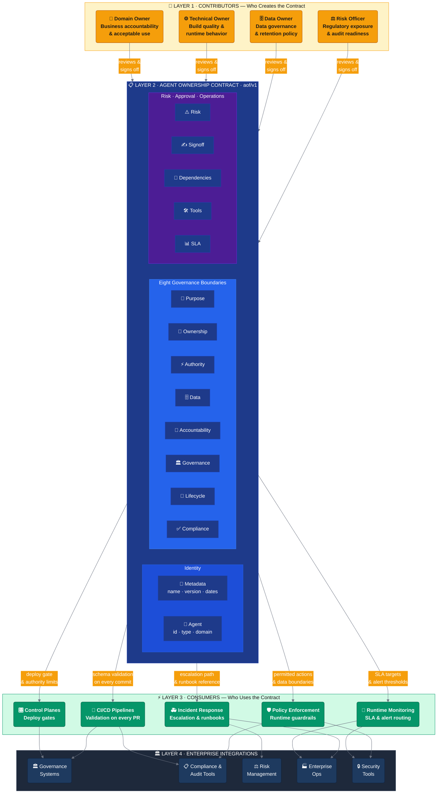

# AI Agent Governance Contract
## Open Standard for Production AI Agent Ownership and Release

Developed by Anitha Jagadeesh

Published under the MIT License.

---

[](https://opensource.org/licenses/MIT)
[](https://github.com/ajwork-art/agent-ownership-framework/releases)
[](https://github.com/ajwork-art/agent-ownership-framework/actions/workflows/ci.yml)
[](docs/SCHEMA.md)
[](MIGRATION.md)
[](CONTRIBUTING.md)

> **An agent is a product with delegated authority.** Treat it like one.

A production-grade, open-source framework for defining, documenting, and formalizing ownership of AI agents in enterprise environments. Inspired by the data contract movement and the author's experience governing production AI systems in enterprise environments.

---

## Scope

This repository is a governance standard and deployment-time contract validation layer.

It covers:
- Agent ownership contract schema
- Deployment readiness contract validation
- Eight governance pre-deployment checks
- CI/CD deployment gates

It does NOT cover:
- Runtime policy enforcement at inference time
- Runtime action interception or execution-time modification

Runtime enforcement is a separate architectural concern not covered by this repository.

---

## What's In This Repository

- `schema/` — Agent ownership contract schema
- `tools/` — Contract completeness validation tooling
- `examples/` — Example contracts by use case
- `ci-cd/` — CI/CD deployment check configurations
- `templates/` — Contract templates and implementation guides
- `docs/` — Implementation documentation

---

## Why This Exists

Enterprise AI deployments have a governance gap.

Teams build agents that query production databases, send emails, approve transactions, and modify customer records — but they cannot answer basic questions about who owns the agent, who approved its authority, what happens when it fails, and who gets paged at 2 AM.

This is not a tooling problem. It is an ownership problem.

The Agent Ownership Framework (AOF) closes that gap with machine-readable contracts that define — in a structured, version-controlled, validated format — exactly who owns each agent, what it is authorized to do, and how it is governed.

**Before deploying any agent, your team should be able to answer these eight questions:**

1. **Who owns this agent?** — A named human, not a team or a system
2. **What is it authorized to do?** — Specific actions, not "whatever the task requires"
3. **What data can it access?** — Classifications, retention policies, PII handling
4. **What happens when it fails?** — Incident contacts, runbooks, escalation paths
5. **Who reviews it and how often?** — Named reviewers, scheduled cadences
6. **What compliance frameworks apply?** — SOX, GLBA, PCI-DSS, GDPR, and others
7. **What is the blast radius if it malfunctions?** — Worst-case impact, documented
8. **How is it retired?** — Deprecation criteria, replacement agent, retirement date

If you cannot answer all eight, you are not ready to deploy.

---

## Installation

The validator ships as an installable package in two ecosystems. Both install a
single `aof` command with matching verbs (`aof validate`, `aof check`). AOF performs
**deployment-time** contract validation — it does not enforce policy at runtime.

**Python (`aof-validate`, installs the `aof` command):**

```bash
pip install aof-validate
```

**Node.js (`aof-validate`, installs the `aof` command):**

```bash
npm install -g aof-validate
```

**From source, when developing this repository:**

```bash
pip install ./tools
npm install -g ./tools
```

> **Package names.** The bare `aof` name is already taken by unrelated projects on
> both PyPI and npm, so the distribution is published as **`aof-validate`**. The
> installed command is still `aof`.

Verify the install:

```bash
aof --version
aof validate examples          # validate every contract in a directory
```

The standalone scripts (`tools/validate-contract.py`, `tools/validate-contract.js`)
still work but are **deprecated** in favor of the `aof` command.

---

## Quick Start

**Step 1: Copy the template**

```bash
cp templates/contract-template.yaml my-agent-contract.yaml
```

**Step 2: Fill in required fields**

```yaml
apiVersion: aof/v1
kind: AgentOwnershipContract

metadata:
  name: payment-processing-agent
  version: 1.0.0
  created: "2026-01-15"
  updated: "2026-01-15"

agent:
  id: payment-processing-agent
  name: Payment Processing Agent
  description: >
    Processes payment transactions for the checkout pipeline. Validates payment
    methods, applies fraud screening, and routes approved transactions to the
    payment gateway. Does not store raw card data.
  type: hybrid
  domain: financial-services

ownership:
  domain_owner:
    name: Jane Smith
    email: jane.smith@company.com
    role: Director, Payments Platform
    accountability:
      - outcome_delivery
      - business_impact
  
  technical_owner:
    name: Marcus Johnson
    email: marcus.johnson@company.com
    role: Engineering Lead, Platform
    accountability:
      - build_quality
      - runtime_behavior
```

**Step 3: Fill in authority, accountability, governance, compliance, risk, and SLA sections**

See [examples/fraud-detection-agent.yaml](examples/fraud-detection-agent.yaml) for a fully completed contract across all sections, or [schema/v1/agent-ownership-contract.example.yaml](schema/v1/agent-ownership-contract.example.yaml) for a field-by-field annotated reference. The [templates/contract-checklist.md](templates/contract-checklist.md) will tell you if you have missed anything.

**Step 4: Validate your contract**

Install the `aof` command (see [Installation](#installation)), then:

```bash
aof validate my-agent-contract.yaml     # a file, a directory, or a glob
aof check my-agent-contract.yaml        # eight-boundary governance checklist
```

**Step 5: Commit and enforce**

```bash
git add my-agent-contract.yaml
git commit -m "feat: add agent ownership contract for payment processing agent"
```

Add the [CI/CD workflow](.github/workflows/ci.yml) to validate all contracts on every pull request.

---

## GitHub Action

This repository ships a composite GitHub Action ([`action.yml`](action.yml)) that
runs `aof validate` against a configurable contracts directory. It performs
**deployment-time** validation only; it does not enforce policy at runtime.

**Usage in a consumer repository:**

```yaml
# .github/workflows/aof.yml
name: Validate AOF contracts
on: [push, pull_request]

jobs:
  aof:
    runs-on: ubuntu-latest
    steps:
      - uses: actions/checkout@v4
      - uses: ajwork-art/agent-ownership-framework@v1
        with:
          contracts: contracts   # file, directory, or glob (default: contracts)
          strict: "true"         # fail if no contracts are found (default: false)
```

**Inputs:**

| Input | Required | Default | Description |
|-------|----------|---------|-------------|
| `contracts` | no | `contracts` | Path, directory, or glob of contract YAML files. Directories are searched recursively for `*.yaml` / `*.yml`. |
| `strict` | no | `false` | If `true`, fail when no contract files are found under `contracts`. |
| `python-version` | no | `3.11` | Python version used to run the validator. |

### Publishing to the GitHub Marketplace

The action is prepared for a Marketplace listing but is **not yet published**. To
list it:

1. Ensure `action.yml` is at the repository root (it is), with `name`, `description`,
   and a `branding` block (icon `check-circle`, color `blue`).
2. Create a release whose tag is a semantic version (for example `v1`), and check
   **"Publish this Action to the GitHub Marketplace"** in the release UI.
3. Choose categories such as *Code quality* and *Continuous integration*.

Suggested Marketplace copy:

> **AOF Validate** — Validate machine-readable AI agent ownership contracts on every
> push and pull request. Deployment-time governance validation for who owns an agent,
> what it is authorized to do, and how it is governed. Does not enforce policy at runtime.

---

## v1 → v2: what changed

v2 is **fully backward compatible** — every valid v1 contract still validates, and
no new fields are required. See [MIGRATION.md](MIGRATION.md) for the full guide.

- **Tooling is packaged.** The validator ships as the installable `aof` command
  (Python `aof-validate`, Node `aof-validate`); the standalone scripts are deprecated.
- **New optional field:** `schema_version` (absent ⇒ `1.0`, with an informational
  notice — never an error).
- **New commands:** `aof scan`, `aof diff`, `aof verify`, `aof export`, plus
  lifecycle enforcement and `--strict` in `aof validate`.
- **Same scope.** AOF still validates at deployment time and generates policy
  *inputs*; it does not enforce policy at runtime.

## CLI reference

All commands are deployment-time tooling. `aof validate` is available in both the
Python and Node packages; the rest are provided by the Python package.

| Command | What it does |
|---------|--------------|
| `aof validate <path> [--strict] [--output json]` | Validate a file/dir/glob against the schema + semantic + lifecycle checks. `--strict` fails on lifecycle warnings or no files found. |
| `aof check <file>` | Human-readable eight-boundary governance checklist. |
| `aof create <name.yaml>` | Scaffold a new contract from the template. |
| `aof scan <dir> [--json]` | Fleet inventory: per-contract status, owners, coverage stats. |
| `aof diff <old> <new> [--require-reapproval]` | Semantic diff; classify material vs cosmetic changes. |
| `aof verify <file> [--signature SIG]` | Optional detached GPG signature verification. |
| `aof export --format markdown\|a2a-card\|opa <file> [-o OUT]` | Generate an ownership card, an experimental A2A card, or a Rego policy stub. |

## v2 capabilities

AOF v2 adds fleet-scale governance commands to the `aof` CLI. Everything below is
**deployment-time** tooling: it validates contracts and generates policy *inputs*.
It does not enforce policy at runtime. v2 is fully backward compatible — a valid v1
contract still validates and receives an informational notice that `schema_version`
defaults to `1.0`.

**Lifecycle enforcement** — `aof validate` flags contracts whose governance/lifecycle
dates have passed (`governance.next_review`, `lifecycle.retirement_date`,
`lifecycle.retirement.sunset_date`, `lifecycle.retirement.planned_review_date`). These
are warnings by default; `--strict` promotes them to CI-blocking failures.

```bash
aof validate contracts               # warns on stale contracts, exits 0
aof validate --strict contracts      # stale contract → non-zero (CI gate)
```

**`aof scan`** — fleet inventory. Answers "which agents have no owner or a stale
contract?" across a directory.

```bash
aof scan contracts                   # human-readable table + summary
aof scan --json contracts            # per-contract status + coverage stats
```

**`aof diff <old> <new>`** — semantic diff. Classifies changes as **material**
(anything under `authority`, `data`, `ownership.escalation_path`, or `signoff`) vs.
cosmetic. `--require-reapproval` exits non-zero when material changes are present but
the `signoff` block is unchanged.

```bash
aof diff v1.yaml v2.yaml --require-reapproval
```

**`aof verify`** — optional detached-signature verification (GPG). Signing is never
required and AOF ships no PKI or private keys; this is a defense-in-depth option. See
[docs/INTEGRATION.md](docs/INTEGRATION.md) for the GPG and Sigstore/cosign recipes.

```bash
gpg --armor --detach-sign my-agent.yaml   # sign out of band → my-agent.yaml.asc
aof verify my-agent.yaml                   # verifies against my-agent.yaml.asc
```

**`aof export --format <fmt>`** — generate artifacts from a validated contract:

| Format | Output | Notes |
|--------|--------|-------|
| `markdown` | One-page ownership card for wikis/runbooks | — |
| `a2a-card` | A2A Agent Card JSON (overlapping fields) | **Experimental** — mapped against the [A2A spec](https://a2a-protocol.org/latest/specification/); review before publishing |
| `opa` | Rego policy stub from authority/data sections | Contains `TODO` markers; **AOF generates policy inputs, it does not enforce** |

```bash
aof export --format markdown my-agent.yaml -o ownership-card.md
aof export --format opa my-agent.yaml -o policy.rego
```

---

## AOF Ecosystem

The Agent Ownership Framework connects four layers of the enterprise AI stack: the named humans who write and sign contracts, the contract itself with its eight governance boundaries, the systems that consume and enforce it at deploy-time and runtime, and the enterprise platforms that ingest it for audit, risk, and operations. The diagram below shows how each layer feeds the next — from a domain owner signing off, to a CI/CD gate blocking a broken contract, to a risk management platform receiving the blast radius assessment.



See [docs/aof-ecosystem.md](docs/aof-ecosystem.md) for the full diagram with layer-by-layer descriptions, rendering instructions, and a color legend.

---

## Why YAML?

YAML is human-readable, version-controllable, commentable, and supported by every CI/CD system. Combined with Git, it gives you an immutable audit trail — who created the contract, who changed it, when, and why. For tamper-resistance in CI/CD: store a SHA-256 hash of the contract alongside it; the validator checks the hash before accepting the contract. JSON is fully equivalent for tooling; the schema ships in JSON for machine consumption. TOML and HCL are viable alternatives but lack the comment support that makes contracts readable to non-engineers.

---

## Why not Open Policy Agent?

OPA enforces policy at runtime — it decides whether a specific request is allowed at the moment it happens. AOF defines governance at design time — it answers who owns an agent, what it is authorized to do, and who is accountable before the agent is deployed. These solve different problems and complement each other: AOF defines the contract, and a separate runtime policy layer may choose to enforce those boundaries.

---

## Directory Structure

```
agent-ownership-framework/
├── README.md                          # This file
├── LICENSE                            # MIT License
├── CONTRIBUTING.md                    # Contribution guidelines
├── CHANGELOG.md                       # Keep a Changelog history
├── action.yml                         # Composite GitHub Action (aof validate)
│
├── schema/
│   ├── README.md                      # Schema documentation
│   └── v1/
│       ├── agent-ownership-contract.schema.json   # JSON Schema (draft-07)
│       └── agent-ownership-contract.example.yaml  # Annotated reference example
│
├── examples/
│   ├── README.md                      # Examples index
│   ├── support-agent.yaml             # Customer support (autonomous, medium risk)
│   ├── operations-agent.yaml          # Operations workflow (hybrid, medium risk)
│   ├── fraud-detection-agent.yaml     # Fraud detection (autonomous, critical risk)
│   ├── risk-analysis-agent.yaml       # Risk analysis (advisory, high risk)
│   └── internal-tool-agent.yaml       # Internal tooling (autonomous, low risk)
│
├── tools/
│   ├── README.md                      # Tool documentation
│   ├── pyproject.toml                 # Python package (aof-validate → `aof`)
│   ├── aof/                           # Python package sources + bundled schema
│   ├── tests/                         # Python (pytest) tests
│   ├── package.json                   # Node package (aof-validate → `aof`)
│   ├── bin/aof.js                     # Node `aof` CLI entry point
│   ├── lib/validator.js               # Node validator core
│   ├── test/                          # Node (node:test) tests
│   ├── validate-contract.py           # Deprecated standalone Python script
│   └── validate-contract.js           # Deprecated standalone Node script
│
├── docs/
│   ├── FRAMEWORK.md                   # Framework concepts and walkthrough
│   ├── PRINCIPLES.md                  # Four core principles
│   ├── SCHEMA.md                      # Complete field reference
│   ├── INTEGRATION.md                 # Runtime and CI/CD integration
│   ├── COMPLIANCE.md                  # Regulatory framework mappings
│   ├── TROUBLESHOOTING.md             # Common issues and solutions
│   └── FAQ.md                         # Frequently asked questions
│
├── templates/
│   ├── contract-template.yaml         # Blank contract with comments
│   ├── contract-checklist.md          # Pre-launch verification checklist
│   ├── implementation-guide.md        # Week-by-week enterprise roadmap
│   └── schema-fields-explained.md     # Non-technical field explanations
│
└── ci-cd/
    ├── README.md                      # CI/CD integration overview
    ├── github-actions-validate.yml    # GitHub Actions workflow
    ├── gitlab-ci.yml                  # GitLab CI equivalent
    └── terraform-validate.tf          # Terraform integration
```

---

## Documentation

| Document | Description |
|----------|-------------|
| [MIGRATION.md](MIGRATION.md) | v1 → v2 migration: v1 stays valid, opting into v2 fields, adopting signing |
| [ROADMAP.md](ROADMAP.md) | Planned direction and future work |
| [docs/FRAMEWORK.md](docs/FRAMEWORK.md) | Framework concepts, the delegation problem, ownership failure patterns, agent lifecycle |
| [docs/PRINCIPLES.md](docs/PRINCIPLES.md) | The four core AOF principles with schema field mappings |
| [docs/SCHEMA.md](docs/SCHEMA.md) | Complete field-by-field reference for every schema section |
| [docs/INTEGRATION.md](docs/INTEGRATION.md) | CI/CD enforcement, GitHub Actions, GitLab, Terraform, pre-commit hooks |
| [docs/COMPLIANCE.md](docs/COMPLIANCE.md) | Regulatory mappings for SOX, GLBA, PCI-DSS, GDPR, HIPAA, EU AI Act |
| [docs/FAQ.md](docs/FAQ.md) | Common questions and answers |
| [docs/TROUBLESHOOTING.md](docs/TROUBLESHOOTING.md) | Common validation errors and how to fix them |
| [templates/implementation-guide.md](templates/implementation-guide.md) | Week-by-week enterprise adoption roadmap |
| [templates/contract-checklist.md](templates/contract-checklist.md) | Pre-launch checklist — verify all eight governance questions before deploying |
| [tools/README.md](tools/README.md) | Validator usage, all flags, example output, and common error fixes |

---

## Examples

Production-realistic examples covering common enterprise agent patterns. The last two
exercise v2 fields (`schema_version`, lifecycle dates, four-role sign-off, and an
orchestrator modeled via dependencies).

| Example | Domain | Risk Tier | Type | Key Compliance |
|---------|--------|-----------|------|----------------|
| [support-agent.yaml](examples/support-agent.yaml) | Customer Service | Medium | Autonomous | SOX, GLBA |
| [operations-agent.yaml](examples/operations-agent.yaml) | Operations | Medium | Hybrid | SOX |
| [fraud-detection-agent.yaml](examples/fraud-detection-agent.yaml) | Financial Services | Critical | Autonomous | PCI-DSS, BSA-AML, SOX, GLBA |
| [risk-analysis-agent.yaml](examples/risk-analysis-agent.yaml) | Risk Management | High | Advisory | GDPR, SOX, FCRA, GLBA |
| [internal-tool-agent.yaml](examples/internal-tool-agent.yaml) | Internal Tooling | Low | Autonomous | Internal policy only |
| [retention-sweeper-agent.yaml](examples/retention-sweeper-agent.yaml) **(v2)** | Data Governance | High | Autonomous | GDPR, SOX |
| [orchestrator-agent.yaml](examples/orchestrator-agent.yaml) **(v2)** | Insurance Operations | High | Hybrid | SOX, NAIC |

---

## Validation Tools

| Package | Language | Install | Command |
|---------|----------|---------|---------|
| [`aof-validate`](tools/pyproject.toml) | Python 3.8+ | `pip install ./tools` | `aof validate` |
| [`aof-validate`](tools/package.json) | Node.js 18+ | `npm install -g ./tools` | `aof validate` |

Both packages validate against the JSON Schema, check email and date formats, verify SLA ranges, and confirm escalation path sequencing. See [Installation](#installation) for details. The `aof validate` verb accepts a file, a directory (searched recursively), or a glob, and supports `--strict` and `--output json`.

---

## Related Resources

This repository is part of the AI Agent Governance Framework:

- **Article:** [An Agent Is a Product With Delegated Authority](https://enterprisedataairealities.substack.com/p/an-agent-is-a-product-with-delegated) — Enterprise Data AI Realities on Substack

- **Agent Boundary Evaluator:** [innocorestrategy.com/agent-boundary-assessment](https://innocorestrategy.com/agent-boundary-assessment/) — AI Agent Governance Standard and assessment tool

- **This repository:** Deployment-time contract validation layer

---

## Contributing

Contributions are welcome — especially new examples, compliance mappings, and tool integrations.

See [CONTRIBUTING.md](CONTRIBUTING.md) for guidelines on:
- How to submit a new agent contract example
- What makes a good example (the hard decisions, not the easy ones)
- Code of conduct and PR process

---

## Citation

If you reference AOF in a paper, blog, or presentation:

```
Jagadeesh, Anitha. Agent Ownership Framework (AOF), v1.0.0. 2026.
https://github.com/ajwork-art/agent-ownership-framework
Enterprise Data AI Realities — Substack.
```

---

## Attribution

If you use, adapt, or build on this standard, please preserve the original copyright and license notice.

> "AI Agent Governance Contract — Anitha Jagadeesh"

If you reference this work publicly, please link back to this repository.

---

## License

MIT License — Copyright 2026 Anitha Jagadeesh

See [LICENSE](LICENSE) for full terms.

---

*Built by [Anitha Jagadeesh](https://enterprisedataairealities.substack.com/).*
