# AOF Ecosystem Diagram

How the Agent Ownership Framework fits into an enterprise AI stack — from the people
who write contracts, to the contract itself, to the systems that consume and enforce it.

---

## Diagram

```mermaid
%%{init: {"theme": "base", "themeVariables": {
  "primaryColor":       "#1E3A8A",
  "primaryTextColor":   "#FFFFFF",
  "primaryBorderColor": "#1E40AF",
  "lineColor":          "#6B7280",
  "secondaryColor":     "#F59E0B",
  "tertiaryColor":      "#059669"
}}}%%

flowchart TD

    %% ═══════════════════════════════════════════════════════════
    %% LAYER 1 — CONTRIBUTORS
    %% Who reviews, signs, and is accountable for each contract.
    %% ═══════════════════════════════════════════════════════════

    subgraph CONTRIB["  👥  LAYER 1 · CONTRIBUTORS — Who Creates the Contract  "]
        direction LR
        DOM("🏢 Domain Owner\nBusiness accountability\n& acceptable use")
        TEO("⚙️ Technical Owner\nBuild quality &\nruntime behavior")
        DAO("🗄️ Data Owner\nData governance\n& retention policy")
        RCO("⚖️ Risk Officer\nRegulatory exposure\n& audit readiness")
    end

    %% ═══════════════════════════════════════════════════════════
    %% LAYER 2 — THE CONTRACT
    %% The structured, version-controlled, machine-validated record
    %% that defines everything about one agent before it ships.
    %% ═══════════════════════════════════════════════════════════

    subgraph AOF["  📋  LAYER 2 · AGENT OWNERSHIP CONTRACT · aof/v1  "]
        direction LR

        subgraph IDENTITY["  Identity  "]
            direction LR
            MD["📄 Metadata\nname · version · dates"]
            AG["🤖 Agent\nid · type · domain"]
        end

        subgraph BOUNDS["  Eight Governance Boundaries  "]
            direction LR
            PU["🎯 Purpose\nbusiness_purpose\nsuccess_metrics\nout_of_scope"]
            OW["👤 Ownership\ndomain_owner\ntechnical_owner\nescalation_path"]
            AU["⚡ Authority\nautonomous_decisions\nprohibited_actions\noverride_mechanism"]
            DA["🗄️ Data\npermitted_sources\nprohibited_sources\nsensitive_data_handling"]
            IR["🚨 Accountability\ninvestigator\ninvestigation_scope\ncommunication"]
            GV["🏛️ Governance\nreview_cadence\nchange_control_board\napproval_required_for"]
            LC["🔄 Lifecycle\nstatus · monitoring\nversioning · retirement"]
            CP["✅ Compliance\nframeworks\ndata_classification\naudit_log_required"]
        end

        subgraph CONTROL["  Risk · Approval · Operations  "]
            direction LR
            RK["⚠️ Risk\nrisk_tier\nblast_radius\nhuman_in_the_loop"]
            SG["✍️ Signoff\ndomain_owner\ntechnical_owner\ndate · confirmation"]
            DP["🔗 Dependencies\nmodels · services\ndata_sources"]
            TL["🛠️ Tools\nvalidate-contract.py\naof CLI · package.json"]
            SL["📊 SLA\navailability\nmax_latency_ms\nerror_rate"]
        end
    end

    %% ═══════════════════════════════════════════════════════════
    %% LAYER 3 — CONSUMERS
    %% Systems that read and enforce the contract at deploy-time
    %% and runtime.
    %% ═══════════════════════════════════════════════════════════

    subgraph CONS["  ⚡  LAYER 3 · CONSUMERS — Who Uses the Contract  "]
        direction LR
        CTL("🎛️ Control Planes\nOrchestration &\ndeploy gates")
        CICD("🔁 CI/CD Pipelines\nValidation checks\non every PR")
        MON("📡 Runtime Monitoring\nMetrics, SLA tracking\n& alert routing")
        INC("🚑 Incident Response\nOn-call runbooks\n& escalation paths")
        POL("🛡️ Policy Enforcement\nRuntime guardrails\n& access control")
    end

    %% ═══════════════════════════════════════════════════════════
    %% LAYER 4 — ENTERPRISE INTEGRATIONS
    %% Downstream platforms that ingest contract data for
    %% audit, risk, and operational purposes.
    %% ═══════════════════════════════════════════════════════════

    subgraph ENT["  🏛️  LAYER 4 · ENTERPRISE INTEGRATIONS  "]
        direction LR
        GS("🏛️ Governance\nSystems\nServiceNow · Jira")
        CA("📋 Compliance &\nAudit Tools\nVanta · Drata")
        RP("⚖️ Risk Management\nPlatforms\nArcher · LogicGate")
        EO("🏭 Enterprise Ops\nDatadog · PagerDuty\nSplunk")
        SEC("🔒 Security Tools\nSentinel · Wiz\nOPA · Vault")
    end

    %% ═══════════════════════════════════════════════════════════
    %% CONNECTIONS — Layer 1 → Layer 2
    %% Each contributor role signs the contract before the agent
    %% is permitted to go to production.
    %% ═══════════════════════════════════════════════════════════

    DOM -->|"reviews &\nsigns off"| AOF
    TEO -->|"reviews &\nsigns off"| AOF
    DAO -->|"reviews &\nsigns off"| AOF
    RCO -->|"reviews &\nsigns off"| AOF

    %% ═══════════════════════════════════════════════════════════
    %% CONNECTIONS — Layer 2 → Layer 3
    %% The validated contract is consumed by downstream systems
    %% as the authoritative source of truth.
    %% ═══════════════════════════════════════════════════════════

    AOF -->|"deploy gate\n& authority limits"| CTL
    AOF -->|"schema validation\non every commit"| CICD
    AOF -->|"SLA targets\n& alert thresholds"| MON
    AOF -->|"escalation path\n& runbook reference"| INC
    AOF -->|"permitted actions\n& data boundaries"| POL

    %% ═══════════════════════════════════════════════════════════
    %% CONNECTIONS — Layer 3 → Layer 4
    %% Consumer systems push contract-derived signals into
    %% enterprise platforms for audit, risk, and operations.
    %% ═══════════════════════════════════════════════════════════

    CTL  --> GS
    CICD --> GS
    CICD --> CA
    MON  --> EO
    MON  --> SEC
    INC  --> RP
    INC  --> EO
    POL  --> SEC
    POL  --> CA

    %% ═══════════════════════════════════════════════════════════
    %% STYLING — classDef sets node fill/stroke/text
    %% ═══════════════════════════════════════════════════════════

    classDef contributor fill:#F59E0B,stroke:#B45309,color:#1C1917,font-weight:bold
    classDef consumer    fill:#059669,stroke:#065F46,color:#FFFFFF,font-weight:bold
    classDef enterprise  fill:#1E3A5F,stroke:#0F2340,color:#FFFFFF

    class DOM,TEO,DAO,RCO contributor
    class CTL,CICD,MON,INC,POL consumer
    class GS,CA,RP,EO,SEC enterprise

    %% Subgraph backgrounds
    style CONTRIB fill:#FEF3C7,stroke:#F59E0B,color:#1C1917
    style AOF     fill:#1E3A8A,stroke:#1E40AF,color:#FFFFFF
    style IDENTITY fill:#1D4ED8,stroke:#2563EB,color:#FFFFFF
    style BOUNDS   fill:#2563EB,stroke:#3B82F6,color:#FFFFFF
    style CONTROL  fill:#4C1D95,stroke:#6D28D9,color:#FFFFFF
    style CONS    fill:#D1FAE5,stroke:#059669,color:#1C1917
    style ENT     fill:#1E293B,stroke:#334155,color:#FFFFFF
```



---

## Layer Descriptions

### Layer 1 — Contributors (Gold)

The four named governance roles who write, review, and sign the contract before an agent goes to production.
Every owner is a named individual — never a team alias.

| Role | Accountability |
|------|---------------|
| **Domain Owner** | Business purpose, acceptable use, and business risk if the agent fails |
| **Technical Owner** | Build quality, runtime behavior, and operational runbooks |
| **Data Owner** | Data access compliance, retention policy, and data quality |
| **Risk Officer** | Regulatory exposure, audit readiness, and compliance posture |

No contract may go to production without signoff from at least the domain owner and technical owner.

---

### Layer 2 — Agent Ownership Contract v1 (Blue)

The structured, version-controlled, machine-validated record that defines everything about
one agent before it ships. Three internal groups:

**Identity**

| Section | What it declares |
|---------|-----------------|
| `metadata` | Contract name, version, creation/update dates, labels, annotations |
| `agent` | Agent ID, display name, description, type, domain, tags |

**Eight Governance Boundaries**

| # | Section | What it declares |
|---|---------|-----------------|
| 1 | `purpose` | Business purpose, success metrics, explicit out-of-scope list |
| 2 | `ownership` | Named domain owner, technical owner, data owner, risk owner, escalation path |
| 3 | `authority` | Autonomous decision types, prohibited actions, escalation triggers, override mechanism |
| 4 | `data` | Permitted sources (whitelist), prohibited sources (denylist), sensitive data handling rules |
| 5 | `incident_response` | Primary/secondary investigator, investigation scope, communication owners, post-mortem SLA |
| 6 | `governance` | Review cadence, change control board, approval-required change list |
| 7 | `lifecycle` | Deployment status, versioning policy, monitoring config, retirement criteria |
| 8 | `compliance` | Regulatory frameworks, data classification, PII handling, audit log requirement |

**Risk · Approval · Operations**

| Section | What it declares |
|---------|-----------------|
| `risk` | Risk tier, blast radius, human-in-the-loop requirement, kill switch owner |
| `signoff` | Named signatures with dates from each owner before launch |
| `dependencies` | Models, services, and data sources the agent depends on |
| `tools` | Validation tooling — validate-contract.py, aof CLI, package.json |
| `sla` | Availability target, max latency, error rate threshold, throughput limit |

---

### Layer 3 — Consumers (Green)

Systems that read the validated contract and use it as the authoritative source of truth
for deploy gates, runtime configuration, and incident handling.

| Consumer | How it uses the contract |
|----------|------------------------|
| **Control Planes** | Enforces `authority.autonomous_decisions` limits before agent actions execute |
| **CI/CD Pipelines** | Validates contract schema on every commit; blocks deploy if invalid |
| **Runtime Monitoring** | Configures alert thresholds from `sla` and `lifecycle.monitoring` fields |
| **Incident Response** | Looks up `ownership.escalation_path` and `incident_response` for on-call routing |
| **Policy Enforcement** | Enforces `data.permitted_sources` and `authority.prohibited_actions` at runtime |

---

### Layer 4 — Enterprise Integrations (Dark Navy)

Downstream platforms that ingest contract-derived signals for audit trails,
risk assessment, and operational visibility.

| Platform | What it receives |
|----------|----------------|
| **Governance Systems** | Contract registry, ownership assignments, review schedules (ServiceNow, Jira) |
| **Compliance & Audit** | Audit logs, framework mappings, signoff records (Vanta, Drata, Auditboard) |
| **Risk Management** | Risk tier, blast radius, kill switch status (Archer, LogicGate, ServiceNow GRC) |
| **Enterprise Ops** | SLA dashboards, monitoring outputs, incident timelines (Datadog, PagerDuty, Splunk) |
| **Security Tools** | Permitted action lists, data boundary enforcement (OPA, Vault, Wiz, Sentinel) |

---

## How the Flow Works

```
1. WRITE     → Contributors create my-agent-contract.yaml from the template
2. VALIDATE  → aof validate my-agent-contract.yaml (CI/CD gate)
3. CHECK     → aof check my-agent-contract.yaml (8 boundary gate)
4. SIGN      → Domain owner and technical owner add signoff entries
5. MERGE     → Contract merges into the repository (immutable audit trail)
6. DEPLOY    → Control plane reads contract; enforces authority limits
7. MONITOR   → SLA and monitoring sections drive alert configuration
8. RESPOND   → Incident response section drives on-call routing
9. REVIEW    → Governance section drives scheduled review cadence
10. RETIRE   → Lifecycle section defines decommission criteria
```

---

## Rendering the Diagram

### GitHub

Mermaid renders natively in GitHub markdown. Push `docs/aof-ecosystem.md` to any
GitHub repository and view it in the browser — no plugins required.

### VS Code

Install the [Markdown Preview Mermaid Support](https://marketplace.visualstudio.com/items?itemName=bierner.markdown-mermaid)
extension. Open the file and use `Cmd+Shift+V` (Mac) or `Ctrl+Shift+V` (Windows) to preview.

### Mermaid Live Editor

Paste the diagram block at [mermaid.live](https://mermaid.live) to preview and export
as SVG or PNG for use in Substack, Confluence, or slide decks.

### Substack

Substack does not render Mermaid natively. Export the diagram as a PNG from
[mermaid.live](https://mermaid.live) or the VS Code preview, then upload as an image.

---

## Color Legend

| Color | Layer | Meaning |
|-------|-------|---------|
| 🟡 Gold (`#F59E0B`) | Layer 1 | Contributors — named humans who sign |
| 🔵 Blue (`#1E3A8A`) | Layer 2 | The contract and its sections |
| 🟢 Green (`#059669`) | Layer 3 | Consumers — systems that enforce |
| 🌑 Dark Navy (`#1E3A5F`) | Layer 4 | Enterprise integrations — audit and ops |

---

*Agent Ownership Framework (AOF) v1 — Anitha Jagadeesh, Enterprise Data AI Realities*
